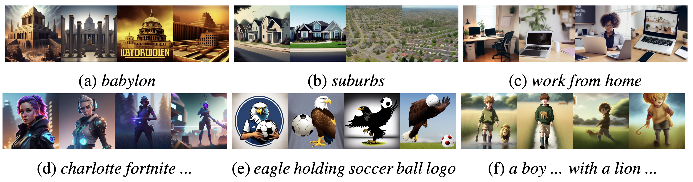

**README**

 **Social Reward: Evaluating and Enhancing Generative AI through Million-User Feedback from an Online Creative Community**

Welcome to the repository of Social Reward – a groundbreaking framework for evaluating the community appeal of AI-generated visual art. In the age of collaborative content creation, users seek validation and motivation through social recognition. Our approach taps into implicit feedback from social network users engaged in creative editing on Picsart, resulting in the first million-user-scale dataset, "Picsart Image-Social."
Repository contains fine-tuning and validating scripts of a Contrastive Learning of Visual Representations (CLIP) model for predicting social reward, utilizing PyTorch and the CLIP libraries.


### Setup

   **Setup environment for running train and validation**
   ```bash
   $ git clone https://github.com/Picsart-AI-Research/Social-Reward
   $ cd Social-Reward
   $ python -m venv venv
   $ pip install pip --upgrade
   $ pip install -r requirements.txt
   ```

### Files and Structure

1. **PromptImagePair Dataset (`data_set.py`):**
    - PyTorch Dataset for loading paired data (text prompts, positive images, negative images).
    - Supports loading data from Parquet files or Pandas DataFrame.
    - Applies a specified preprocessing function to the images.

    **Example:**
    ```python
    df = pd.read_parquet('data.parquet')
    preprocess_fn = torchvision.transforms.Compose([torchvision.transforms.Resize(224), torchvision.transforms.ToTensor()])
    dataset = PromptImagePair(df, preprocess_fn)
    item = dataset[0]
    text, pos_img, neg_img = item
    ```

2. **Triplet Loss Module (`losses.py`):**
    - PyTorch module for computing the triplet loss.
    - Used for training deep embeddings for similarity learning.

    **Example:**
    ```python
    loss_fn = TripletLoss(margin=0.2)
    anchor = torch.randn(16, 256)
    positive = torch.randn(16, 256)
    negative = torch.randn(16, 256)
    loss = loss_fn(anchor, positive, negative)
    ```
### Running the Example

1. **Data Preparation:**
    - Prepare a Parquet file (`train_data.parquet`) containing paired data (prompt, positive image path, negative image path).
    - Similarly, prepare a validation Parquet file (`validation_data.parquet`).

    **Example Parquet File Structure (`train_data.parquet` and `validation_data.parquet`):**

    | prompt     | pos_path                             | neg_path                             |
    |------------|--------------------------------------|--------------------------------------|
    | "Prompt 1" | "/path/to/remixable/image1.jpg"      | "/path/to/non-remixable/image2.jpg"  |
    | "Prompt 2" | "/path/to/remixable/image3.jpg"      | "/path/to/non-remixable/image4.jpg"  |
    | ...        | ...                                  | ...                                  |

    - `prompt`: Text prompt corresponding to each pair of positive and negative images.
    - `pos_path`: Path to the image considered remixable.
    - `neg_path`: Path to the image considered non-remixable.

2. **Training:**
    - Fine-tune the CLIP model using the training script.
    ```bash
   accelerate launch\
    train_pair_pos_neg.py\
    --training_file training_file.parquet\
    --training_mode visual_upper_layers_textual_upper_layers\
    --batch_size 32\
    --n_epochs 10\
    --save_folder ./clip_model\
    --loss_name triplet
    ```

3. **Validation:**
    - Validate the fine-tuned model using the validation script.
    ```bash
    python validate.py 'validation_data.parquet' --checkout_path 'classifier_checkpoint.pth' --device 'cuda' --batch_size 1024 --num_workers 9
    ```

### BibTeX

If you use our work in your research, please cite our publication:

  
